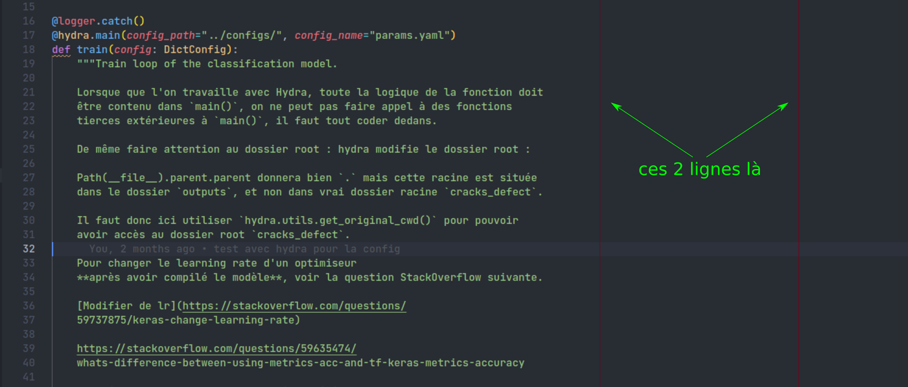

# Configuration de VSCode

On parlera ici de la configuration de vscode, c'est l'un des IDE standards et il offre beaucoup de possibilités :

- l'intégration de nombreux plugins,
- la possibilité d'avoir un IDE lors d'une connexion ssh,
- la possibilité de travailler directement dans un environnement de dev Docker depuis vscode...

D'autres ide existent et sont très bien : Atom, PyCharm, Sublime text, le choix de l'IDE pourrait ne pas être fixé.

!!! question
    Doit on fixer le choix de l'IDE, afin d'avoir le même pour tout le monde ? Même si je pense que tout le monde utilise déjà vscode.

La configuration de vscode se fait généralement **de façon globale**, toutefois pour que les configurations soient liées aux projets et non à l'utilisateur, il est important que les configurations puissent voyager avec gitlab, **donc locale**.

!!! info
    Chaque projet vscode peut avoir une configuration locale en fournissant un fichier `settings.json` et en le situant à la racine du projet dans le dossier caché `.vscode`.

      ```
      racine du projet
      |
      |_ .vscode
      |   |
      |   |_ settings.json
      |...
      ```

    Ce projet peut ainsi voyager avec gitlab et petmettre d'avoir toujours la même configuration peut importe le pc depuis lequel le `pull` est fait.

Comme dit précédemment, le fichier de configuration locale est un json, détaillons.


```json
{
  // config générale
  "editor.suggestSelection": "first",
  "workbench.colorTheme": "One Dark Pro",
  "editor.fontLigatures": true,
  "editor.fontFamily": "JetBrains Mono Medium",
  "editor.fontSize": 16,
  "terminal.integrated.cursorStyle": "line",
  "terminal.integrated.cursorWidth": 2,
  "terminal.integrated.fontFamily": "MesloLGS NF",
  "git.autofetch": true,
  "trailing-spaces.trimOnSave": true,
  // config python
  // black
  "python.formatting.provider": "black",
  "python.formatting.blackArgs": [
    "--line-length=88"
  ],
  "editor.formatOnSave": true,
  "editor.formatOnPaste": false,
  "editor.formatOnType": false,
  "editor.rulers": [
    88,
    120
  ],
  "workbench.colorCustomizations": {
    "editorRuler.foreground": "#750917"
  },
  // pylance
  "python.languageServer": "Pylance",
  // isort
  "python.sortImports.path": "isort",
  "python.sortImports.args": [
      "-sp setup.cfg"
  ],
  "[python]": {
    "editor.codeActionsOnSave": {
        "source.organizeImports": true
    }
  },
  // flake8
  "python.linting.flake8Path": "flake8",
  "python.linting.flake8Enabled": true,
  "python.linting.pylintEnabled": false,
  "python.linting.ignorePatterns": [
      ".vscode/*.py",
      "**/site-packages/**/*.py",
      ".venv/**/*.py",
      "**.pytest_cache/**/*.py"
    ],
  // mypy
  "python.linting.mypyPath": "mypy",
  "python.linting.mypyEnabled": true,
  // pytest
  "python.testing.pytestEnabled" : true,
  }
```
On va séparer les explications en deux parties, la partie générale, et la partie Python.

## Configuration générale

```json
{
  // config générale
  "editor.suggestSelection": "first",
  "workbench.colorTheme": "One Dark Pro",
  "editor.fontLigatures": true,
  "editor.fontFamily": "JetBrains Mono Medium",
  "editor.fontSize": 16,
  "terminal.integrated.cursorStyle": "line",
  "terminal.integrated.cursorWidth": 2,
  "terminal.integrated.fontFamily": "MesloLGS NF",
  "git.autofetch": true,
  "trailing-spaces.trimOnSave": true,
}
```
La configuration est plutôt classique, ["JetBrains Mono Medium"](https://www.jetbrains.com/fr-fr/lp/mono/) et ["MesloLGS NF"](https://github.com/romkatv/powerlevel10k#meslo-nerd-font-patched-for-powerlevel10k) sont des polices d'écritures avec ligatures "développées pour la programmation".

!!! note
    La deuxième n'est vraiment utile que si vous utilisez `zsh` comme shell avec [Oh My Zsh](https://ohmyz.sh/) et [Powerlevel10k](https://github.com/romkatv/powerlevel10k#powerlevel10k) et voulait activer Powerlevel10k dans le terminal intégré de vscode.

"One Dark Pro" est un thème sombre dérivé du thème de base de l'IDE Atom, et `"trailing-spaces.trimOnSave": true` est une option du plugins "Trailing Spaces" permettant de supprimer tous les espaces superflux à chaque sauvegarde.


## Configuration avec Python

Pour un projet python, il y a deux endroits que l'on doit configurer :

1. Le fichier `settings.json`.
2. Le fichier `setup.cfg`, situé à la racine du dossier.

Le fichier `settings.json` permet de configurer vscode pour lui dire quel formateur, linter, quelle librairie de tests choisir pour vérifier la qualité du code, le fichier `setup.cfg` lui fixera les paramètres des ces derniers.

!!! note
    D'autres fichiers de configurations des librairies python, comme le fichier `pyproject.toml` défini dans [PEP518](https://www.python.org/dev/peps/pep-0518/), qui est offciellement le fichier de configuration préféré par le formateur `black`, et aussi le fichier de configuration préféré pour le manager de dépendances et de projet [poetry](https://python-poetry.org/). Sauf que

    - les développeurs de `flake8` ont décidés qu'ils ne supporteraient pas le format `pyproject.toml`,
    - les développeurs de `mypy` y réfléchissent...depuis 2018...

    Les librairies `isort`, `pytest` et `coverage` sont compatibles avec `pyproject.toml`, mais dans tous les cas on devrait garder un fichier `setup.cfg` pour `flake8` et tous ses plugins. `black` n'ayant que peu de choix dans ses configurations, autant tout mettre dans un fichier `setup.cfg`.

Dans ce fichier de configuration, on utilise donc :

- [black](https://black.readthedocs.io/en/stable/) pour le formatage du code.
- [isort](https://pycqa.github.io/isort/) pour les triage des imports.
- [flake8](https://flake8.pycqa.org/en/latest/) pour le linting.
- [mypy](https://mypy.readthedocs.io/en/stable/#) pour le type hinting.
- [pytest](https://docs.pytest.org/en/stable/) pour l'ensemble des tests unitaires, d'intégrations, etc.

!!! note
    Ca parait évident, mais même si ces modules sont sélectionnés dans vscode, rien ne marchera s'ils ne sont pas installés dans votre environnement virtuel, environnement docker ou autre.

On reviendra plus en détails sur chacun plus tard, expliquons ce fichier de config.

```json
{
  // config python
  // black
  "python.formatting.provider": "black",
  "python.formatting.blackArgs": [
    "--line-length=88"
  ],
  "editor.formatOnSave": true,
  "editor.formatOnPaste": false,
  "editor.formatOnType": false,
  "editor.rulers": [
    88,
    120
  ],
  "workbench.colorCustomizations": {
    "editorRuler.foreground": "#750917"
  },
  // pylance
  "python.languageServer": "Pylance",
  // isort
  "python.sortImports.path": "isort",
  "python.sortImports.args": [
      "-sp setup.cfg"
  ],
  "[python]": {
    "editor.codeActionsOnSave": {
        "source.organizeImports": true
    }
  },
  // flake8
  "python.linting.flake8Path": "flake8",
  "python.linting.flake8Enabled": true,
  "python.linting.pylintEnabled": false,
  "python.linting.ignorePatterns": [
      ".vscode/*.py",
      "**/site-packages/**/*.py",
      ".venv/**/*.py",
      "**.pytest_cache/**/*.py"
    ],
  // mypy
  "python.linting.mypyPath": "mypy",
  "python.linting.mypyEnabled": true,
  // pytest
  "python.testing.pytestEnabled" : true,
  }
```

### black

La première partie active black comme formateur du code.

- On fixe la longueur maximale **du code** (ie pas de la documentation en docstrings) à 88 caractères avec `python.formatting.blackArgs`, qui est la longueur maximale acceptée par black par défaut.
- On fixe le formatage du code en automatique à chaque sauvegarde, on désactive le formatage lors d'une copie ou lorsque l'on tape.
- Afin d'avoir un repère visuel pour la longueur du code, on crée une règle verticale à 88 caractères et une a 120 caractères via `"editor.rulers"`. La longueur de 120 caractères est un choix personnel pour la longueur maximale des commentaires (de moins en moins utilisé). On choisit la couleur de ces règles verticales via `"editorRuler.foreground"`, ici rouge.



### pylance

Pylance est un plugin de Microsoft permettant permettant un support amélioré du plugin python.

### isort

isort est un module permettant de trier par ordre alphabétique et de façon automatique dans un ordre d'importance précis. Par défaut, l'ordre d'importance est le suivant.

1. FUTURE, `from __future__ import ...`
2. STDLIB, les librairies standards fournies par python de base, par exemple `pathlib`
3. THIRDPARTY, la plupart des autres librairies, numpy, pandas, etc.
4. FIRSTPARTY, les modules provenant du projet python actuel.
5. LOCALFOLDER, les imports locaux, généralement des imports relatifs.

`python.sortImports.args` permet de dire où se trouve le "setup path" (-sp), l'autre action automatise le trie à chaque sauvegarde.

### flake8

`flake8` est un *linter*, il permet de vérifier que la code suit bien certaines règles.

### mypy

### pytest